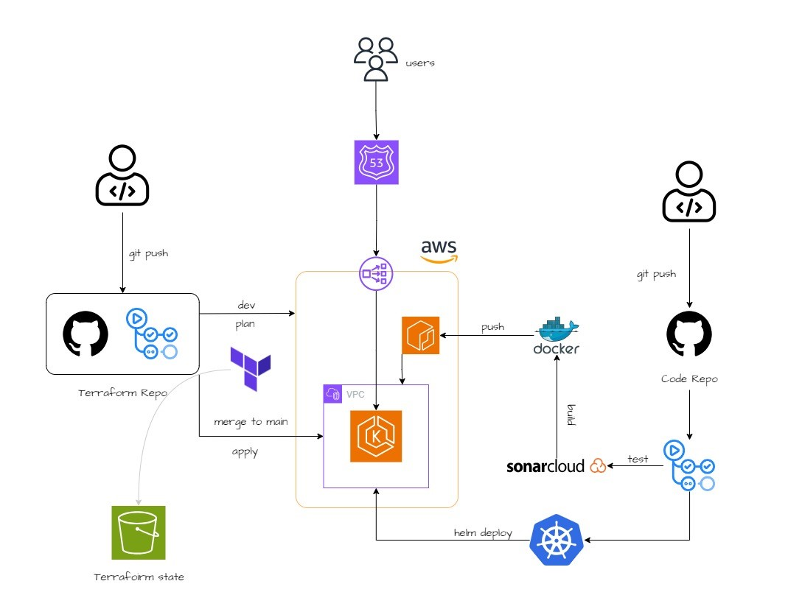

# CI/CD and GitOps - Terraform, GitHub Actions and Kubernetes

This repository contains Helm charts, Kubernetes manifests, and Java code to deploy the Java app on the EKS cluster that we previously provisioned using GitHub actions and Terraform.

#### <a href="https://github.com/YU88John/eks-ecr-gitops-tf">Terraform Repository for this Project</a>

> [!CAUTION]
> This project is for testing purposes. It is strongly advised against using it for production.

## Project Hierarchy

- `/.github/workflows`: GitHub actions file
- `/helm`: Helm charts for the application
- `/kubernetes`: Kubernetes manifest files for the application
- `/src`: Application source code

## Architecture Overview



## Prerequisites

- AWS CLI Setup
- Terraform CLI Setup
- GitHub Account

## Technologies

- AWS (EKS, ECR, and S3)
- Docker
- Java 
- Maven
- SonarQube
- GitHub Actions


## How to test this project

### Clone the repository 

```
git clone https://github.com/YU88John/eks-ecr-gitops-code.git
```

### Create ECR 

We will store our image for this project in <a href="https://aws.amazon.com/ecr/">Elastic Container Registry</a>. Go ahead and create a private registry with a name of your choice.

### Setup SonarCloud 

We will use SonarQube in this project to scan our code. 

#### What is SonarQube?

SonarQube is an open-source platform for continuous inspection of code quality, providing static analysis to identify and manage code smells, bugs, and security vulnerabilities in software projects. It helps developers maintain clean and maintainable code by offering actionable insights and recommendations during the development process. <a href="https://sonarcloud.io/">Read more about SonarQube</a>.

#### Setup SonarCloud Organization

- Log in to SonarCloud with your GitHub
- Under your profile > `Organizations` > `Create`. Choose a name of your choice

#### Create Token for GitHub Actions

- Your profile > `Security` > `Generate Tokens`
> We will store this token as a secret, so keep it safe. 

### Setup Secrets 

This repository actions require various values to perform DevOps processes. It's always a good practice to store sensitive values as secrets. 

#### <a href="https://docs.github.com/en/actions/security-guides/using-secrets-in-github-actions">How to add Secrets in GitHub Actions</a>

- `AWS_ACCESS_KEY_ID`  <a href="https://docs.aws.amazon.com/IAM/latest/UserGuide/id_credentials_access-keys.html">How to Create Access Keys</a>
- `AWS_SECRET_ACCESS_KEY`
- `REGISTRY`: Your registry name(excluding the repository name)
- `SONAR_ORGANIZATION`: Your SonarQube organization name
- `SONAR_PROJECT_KEY`: Your desired name 
- `SONAR_TOKEN`: SonarQube security token
- `SONAR_URL`: https://sonarcloud.io/

